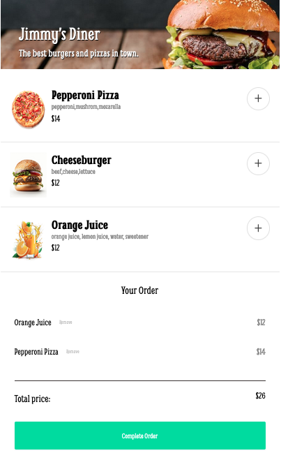
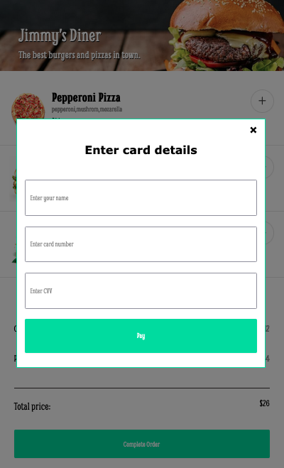
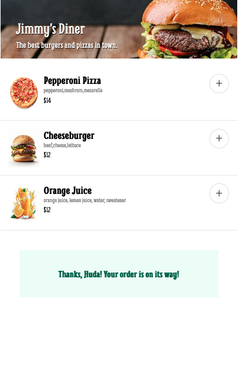

# Restaurant Ordering App

### Modal

### Confirmation

## Description
+ This app is made for the purpose of learning and practicing Essensial JavaScript concepts such as DOM Manipulation, Event Handling, and Array Methods. 
+ The app allows users to conveniently browse through the menu and add items to the cart or remove items from the cart, and finally place the order.
  + This is part of the Scrimba Front-End Career Path projects.

## What is the specs?
- Create the layout based on the figma project
- Render the menu options using the data with JavaScript
- Be able to add/remove items
- Have a payment modal with compulsory form inputs

## Built With

+ HTML
+ CSS
+ JavaScript

## Live Demo

- Live Site URL: [Here](https://restaurant-ordering-app-project.netlify.app)
